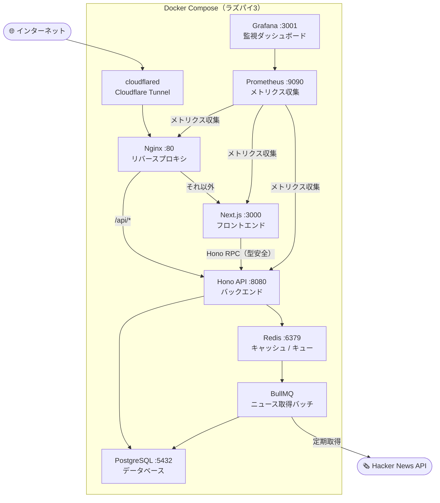
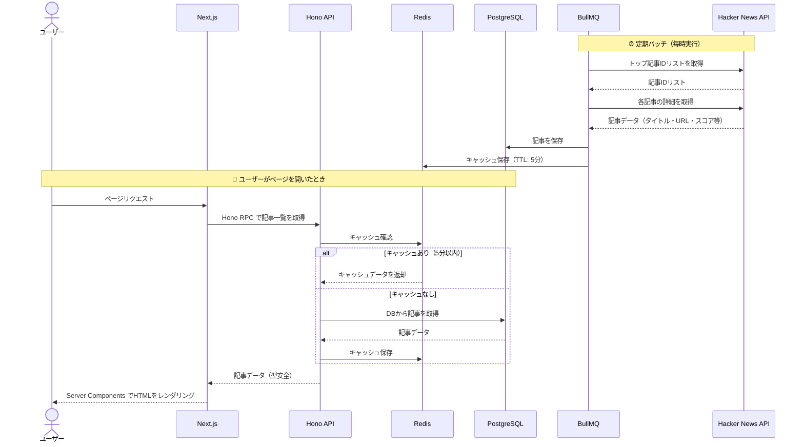
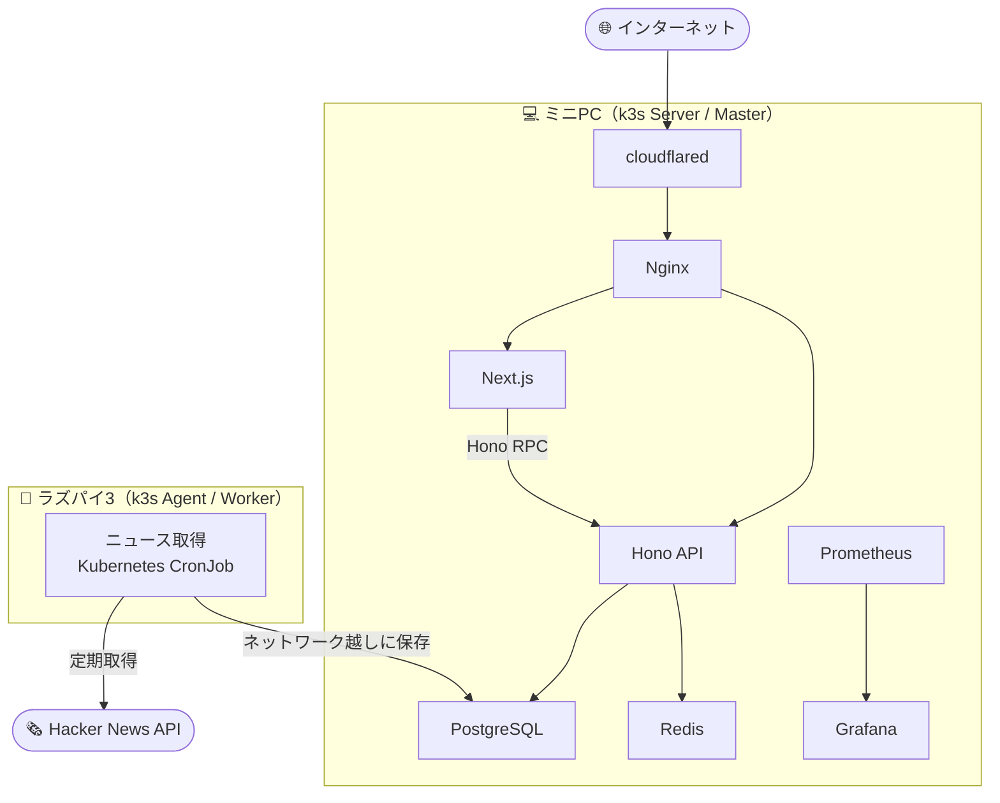
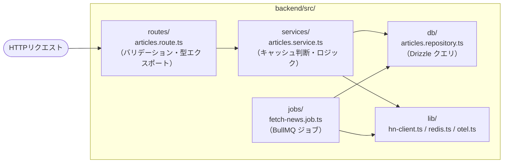

# CLAUDE.md

This file provides guidance to Claude Code (claude.ai/code) when working with code in this repository.

---

## プロジェクト概要

Hacker News のニュースを自動取得・表示するニュースアグリゲーターアプリ。
ラズパイ3単体の Docker Compose 構成から始め、将来的にミニPC追加で k3s 2ノードクラスターへ進化させる。
詳細なロードマップは `plan.md` を参照。

---

## 技術スタック

| 分野 | 技術 |
|------|------|
| フロントエンド | Next.js (App Router), TypeScript, Tailwind CSS |
| バックエンド | Hono + Bun |
| ORM | Drizzle ORM |
| バリデーション | Zod |
| 型安全API | Hono RPC |
| データベース | PostgreSQL |
| キャッシュ | Redis |
| バッチ/ジョブキュー | BullMQ（Redis バックエンド） |
| ユニットテスト | Vitest |
| E2Eテスト | Playwright（Mac で実行） |
| 監視 | Prometheus + Grafana |
| トレース | OpenTelemetry |
| リバースプロキシ | Nginx |
| 外部公開トンネル | Cloudflare Tunnels（`cloudflare/cloudflared`） |
| CI/CD | GitHub Actions |
| インフラ（現在） | Docker Compose（ラズパイ3向けメモリ制限設定） |
| インフラ（将来） | k3s（軽量 Kubernetes）、2ノードクラスター |

---

## ディレクトリ構成

```
techNewsApp/
├── frontend/          # Next.js アプリ
├── backend/           # Hono + Bun アプリ
│   ├── src/
│   │   ├── routes/    # Hono のルート定義（Hono RPC 用型もここからエクスポート）
│   │   ├── db/        # Drizzle スキーマ定義・マイグレーション
│   │   ├── jobs/      # BullMQ ジョブ定義（ニュース取得バッチなど）
│   │   └── lib/       # Redis クライアント、OpenTelemetry 初期化など
├── nginx/             # Nginx 設定ファイル
├── monitoring/        # Prometheus・Grafana 設定
├── .github/workflows/ # GitHub Actions ワークフロー
├── docker-compose.yml # ローカル・ラズパイ本番共通
└── plan.md
```

---

## 主要コマンド

```bash
# フロントエンド（Next.js）
cd frontend && bun dev           # 開発サーバー起動
cd frontend && bun build         # 本番ビルド
cd frontend && bun lint          # ESLint 実行

# バックエンド（Hono + Bun）
cd backend && bun run dev        # ホットリロードで開発サーバー起動
cd backend && bun test           # 全テスト実行
cd backend && bun test <ファイル> # 単一ファイルのテスト実行

# E2E テスト（Playwright）
cd frontend && bun run test:e2e  # ブラウザ自動テスト実行

# Docker Compose
docker compose up -d             # 全コンテナ起動
docker compose logs -f           # ログをストリーム表示
docker compose down              # 全コンテナ停止
docker compose ps                # コンテナ状態確認
```

---

## アーキテクチャ

### 図1：コンテナ構成（Docker Compose フェーズ）



### 図2：ユーザーアクセス時のデータフロー



### 図3：将来構成（k3s 2ノードクラスター）



**各コンテナの役割まとめ：**
- **Nginx** → `/api/*` を Hono へ、それ以外を Next.js へルーティング
- **Hono RPC** → バックエンドのAPI型定義をフロントエンドで直接インポートして使う（型ずれゼロ）
- **BullMQ** → Redis をキューとして使い、定期的に Hacker News API を取得して PostgreSQL に保存
- **Redis** → APIレスポンスのキャッシュ兼 BullMQ のバックエンド
- **OpenTelemetry** → Hono のリクエストトレースを収集し、遅いエンドポイント・クエリを特定

---

## バックエンドアーキテクチャ

### レイヤードアーキテクチャ

バックエンドは3層に分けて実装する。各層の責務を超えた処理は書かない。

```
routes/     ← HTTPの受け口。バリデーション・レスポンス整形のみ
services/   ← ビジネスロジック。キャッシュ判断・外部API呼び出し・DB操作の調整
db/         ← DBアクセスのみ。Drizzle のクエリをここに集約
```



### ファイル命名規則

| 種別 | 命名パターン | 例 |
|------|------------|-----|
| ルート | `*.route.ts` | `articles.route.ts` |
| サービス | `*.service.ts` | `articles.service.ts` |
| DBリポジトリ | `*.repository.ts` | `articles.repository.ts` |
| BullMQ ジョブ | `*.job.ts` | `fetch-news.job.ts` |
| Zod スキーマ | `*.schema.ts` | `article.schema.ts` |
| テスト | `*.test.ts` | `articles.service.test.ts` |

### DB スキーマ（articles テーブル）

```typescript
// backend/src/db/schema.ts
export const articles = pgTable('articles', {
  id:            serial('id').primaryKey(),
  hnId:          integer('hn_id').notNull().unique(),  // HN記事ID（重複排除キー）
  title:         text('title').notNull(),
  url:           text('url'),                           // 外部リンクなし記事は null
  score:         integer('score').notNull().default(0),
  author:        text('author').notNull(),
  commentCount:  integer('comment_count').notNull().default(0),
  fetchedAt:     timestamp('fetched_at').notNull().defaultNow(),
});
```

### API エンドポイント設計

| メソッド | パス | 説明 |
|--------|------|------|
| `GET` | `/health` | ヘルスチェック |
| `GET` | `/api/articles` | 記事一覧（`?limit=30&page=1`） |

---

## 技術ごとの実装方針

### Drizzle ORM
- スキーマ定義は `backend/src/db/schema.ts` に集約する
- マイグレーションファイルは `backend/src/db/migrations/` に生成する
- SQLに近い記法を維持し、生SQLが必要な場合は `db.execute(sql`...`)` を使う

### Zod
- Hacker News API のレスポンスは必ず Zod スキーマで検証する（外部データは信用しない）
- Hono のリクエストバリデーションには `@hono/zod-validator` ミドルウェアを使う
- フロントエンド・バックエンド間で Zod スキーマを共有する場合は `backend/src/lib/schemas/` に置く

### Hono RPC
- `backend/src/routes/` のルート定義から型をエクスポートし、フロントエンドで `hc<AppType>()` クライアントをインポートして使う
- これにより、バックエンドのAPIを変更するとフロントエンドで即座に型エラーが出る

### Redis / BullMQ
- Redis のキャッシュ TTL は原則 **5分**（ニュースの鮮度と負荷のバランス）
- BullMQ ジョブは `backend/src/jobs/` に定義し、Cron 式でスケジュール設定する

### OpenTelemetry
- `backend/src/lib/otel.ts` で初期化し、Hono アプリ起動前に読み込む
- トレースは Jaeger または Grafana Tempo に送信する（Docker Compose に追加）

---

## ラズパイ3 の制約

- 全コンテナに `mem_limit` を設定すること（設定なしは禁止）
- 全コンテナに `restart: always` を設定すること
- ベースイメージは必ず Alpine 系（`node:alpine`, `postgres:alpine` など）を使う
- イメージのビルドは Mac で行い、レジストリ（GitHub Container Registry）経由でラズパイに配布する
- Prometheus + Grafana はリソース消費が多いため、ラズパイでは `mem_limit: 256m` 程度に抑える
- Redis の `maxmemory` を明示的に設定し、ラズパイのメモリを食い尽くさないようにする

---

## 将来：k3s 2ノードクラスター

| ノード | 役割 | ワークロード |
|--------|------|------------|
| ミニPC（Server/Master） | 重い処理 | Next.js, PostgreSQL, Nginx, cloudflared, Prometheus, Grafana |
| ラズパイ3（Agent/Worker） | 軽いバッチ | ニュース取得 BullMQ ジョブ（Kubernetes CronJob に移行） |

- ノードへの振り分けは `nodeAffinity` または `nodeSelector` で制御する
- Docker Compose から k3s 移行時、BullMQ ジョブは Kubernetes CronJob に置き換える

---

## コーディング規約

- コードコメント・ドキュメントは**日本語**で書く
- 変数名・関数名・ファイル名は**英語**で書く（キャメルケース / ケバブケース）
- `any` 型の使用禁止。型が不明な場合は `unknown` を使い Zod で絞り込む

---

## 外部API

**Hacker News API**（認証不要・無料）
```
トップ記事IDリスト: https://hacker-news.firebaseio.com/v0/topstories.json
記事詳細:          https://hacker-news.firebaseio.com/v0/item/{id}.json
```
